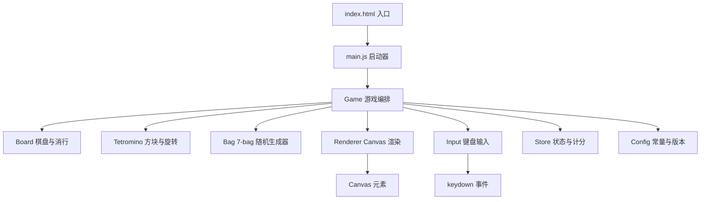
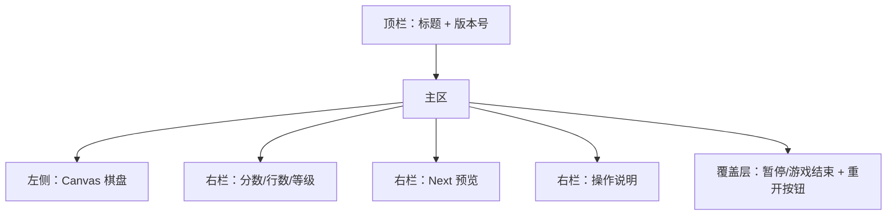
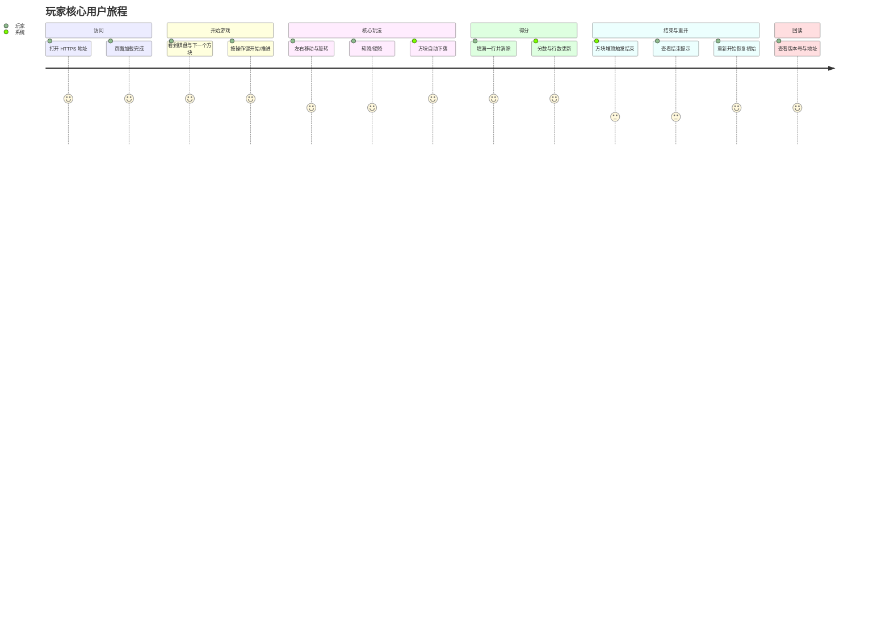

# 技术设计：俄罗斯方块 Web 小游戏

- 文档版本：v1
- 状态：已冻结（technical design baseline）
- 关联 Workflow：3d3911ab-a583-4ad3-bd2d-f14ff598b98c
- 关联 StageRun：23c50e79-b62d-4b65-8621-216a837769d7
- 关联 ActivityRun：84e9eb62-de4e-48eb-b17c-79ccaceda7be
- 输入清单 SHA-256：d8d49d464e724e007a98f7946e01e46ecb0dbb26735fbdeaa96ed4bb1066f269
- 上游需求基线：`.monkeycode/specs/2026-10-05-tetris-web-game/requirements.md`

## 1. 设计目标与原则

本设计承接需求基线，将 R-EARS-01–R-EARS-19 与 AC-001 落地为可实现的工程方案，核心原则：

1. **零依赖、零后端**：纯静态 HTML/CSS/JavaScript，选项上使用 Vite 提供开发服务器与可复现构建，运行时不依赖网络与后端。
2. **单入口可访问**：构建/预览只暴露一个端口，所有资源相对路径加载，适配平台单端口预览。
3. **可测试性优先**：游戏核心逻辑与渲染、输入解耦，提供纯函数式核心便于测试阶段自动化与脚本驱动验证。
4. **可回读版本**：版本号在构建期注入，运行时同时展示在页面与 `window.__APP_VERSION__`/`/version.json`，并关联 git commit。
5. **遵守平台约束**：遵循 guardrail、no-delete、no-long-running-commands，部署使用 `deploy-website` skill 与 `request_preview`。

## 2. 技术选型

| 维度 | 选型 | 理由 |
|---|---|---|
| 语言 | 原生 JavaScript (ES Modules) | 无框架依赖，降低空仓库初始化与构建风险 |
| 渲染 | HTML5 Canvas 2D | 网格游戏性能稳定，易达 60 FPS 量级 |
| 样式 | 原生 CSS | 免构建依赖；仅需少量响应式布局 |
| 构建/开发服务器 | Vite | 快速开发服务器、可复现构建、支持 `server.allowedHosts` 与 `build.outDir` |
| 单元测试（测试阶段用） | Vitest | 与 Vite 同源，零额外配置即可测核心逻辑 |
| 版本注入 | 构建期环境变量 `APP_VERSION` / git short SHA | 版本可回读且与仓库提交关联 |

> 若实现阶段评估 Vite 安装受网络限制，回退方案为纯静态 `index.html` + `python3 -m http.server`（见 11.2 回退路径），功能范围不变。

## 3. 系统架构



### 3.1 模块职责（单一职责）

- `config.js`：常量（列数 10、行数 20、方块形状矩阵、颜色、下落节奏表、计分表、`APP_VERSION`）。
- `tetromino.js`：7 种方块定义、矩阵旋转（含 Wall Kick 简化为基础偏移回退）。
- `bag.js`：7-bag 随机生成器，保证 7 种方块每轮各出现一次。
- `board.js`：棋盘二维网格、碰撞检测 `collide`、锁定 `merge`、消行 `clearLines`。
- `store.js`：分数、行数、等级、状态机（`idle | running | paused | gameover`）。
- `renderer.js`：Canvas 绘制棋盘、活动方块、下一个方块预览。
- `input.js`：键位映射到统一动作（left/right/softDrop/hardDrop/rotate/pause/restart）。
- `game.js`：游戏循环（`requestAnimationFrame` + 固定步进计时）、生成新方块、锁定与结束判定、暂停/重开。
- `main.js`：DOM 装配、渲染器初始化、输入绑定、版本展示、暴露 `window.__TETRIS__` 供测试脚本驱动。

### 3.2 数据流

键盘事件 → `input` 归一化为动作 → `game` 调用 `board/tetromino` 校验并更新模型 → `renderer` 读取模型重绘。渲染与逻辑分离，逻辑层不触碰 DOM，便于单元测试。

## 4. 核心算法设计

### 4.1 棋盘与碰撞

- 棋盘为 `20 行 × 10 列`，空单元为 `null`，已固定单元存颜色索引。
- 碰撞检测：对活动方块每个占用格，若 `col < 0`、`col >= 10`、`row >= 20` 或目标格非空则冲突（`row < 0` 允许，用于出生位置）。
- 锁定 `merge`：冲突且无法下移时将其写入棋盘。

### 4.2 旋转与 Wall Kick

- 采用经典矩阵转置旋转；对旋转后位置尝试偏移序列 `[0, -1, +1, -2, +2]`，取首个无碰撞偏移；全部冲突则拒绝旋转（满足 R-EARS-11）。

### 4.3 7-bag 随机

- 维护一袋 `[I,O,T,S,Z,J,L]` 洗牌后逐个取用，袋空后重新洗牌。

### 4.4 计分与等级

- 行数、得分：`1/2/3/4` 行分别记 `100/300/500/800`（乘以等级）。
- 等级：`level = floor(linesCleared / 10) + 1`；下落间隔随等级缩短，使用节奏表映射，设下限防止不可玩。

### 4.5 游戏循环

- `requestAnimationFrame` 驱动；累计 `delta`，超过当前下落间隔则下移一格；软降立即下移并加分；硬降直落到底并立即锁定。
- 新方块若出生即碰撞 → 状态切 `gameover`（R-EARS-15）。

## 5. UI / 交互设计

### 5.1 页面布局



### 5.2 键位映射（键盘完成全部核心玩法）

| 动作 | 键位 |
|---|---|
| 左移 | `ArrowLeft` / `A` |
| 右移 | `ArrowRight` / `D` |
| 软降 | `ArrowDown` / `S` |
| 硬降 | `Space` |
| 旋转 | `ArrowUp` / `W` |
| 暂停/继续 | `P` |
| 重新开始 | `R` |

### 5.3 响应式与可访问性

- 棋盘 Canvas 使用固定内部分辨率 + CSS 自适应缩放，桌面主流分辨率下不变形；窄屏时右栏堆叠到下方。
- 关键状态文本使用语义化 DOM（分数、行数、等级、状态提示）而非仅绘制在 Canvas，便于读取与测试。
- 提供 `aria-live` 状态提示与可聚焦的重开按钮。

## 6. 用户旅程（User Journey）

以下旅程覆盖从打开线上地址到完成核心玩法的完整闭环。



### 6.1 旅程步骤与需求对应

| # | 旅程步骤 | 用户动作 | 系统响应 | 对应需求 |
|---|---|---|---|---|
| 1 | 访问站点 | 打开 HTTPS URL | 返回页面，无阻断错误 | R-EARS-17 |
| 2 | 加载游戏 | 等待加载 | 渲染 10×20 棋盘、首个方块与 Next 预览 | R-EARS-04/05/14 |
| 3 | 自动下落 | 观察 | 活动方块按节奏下落一格 | R-EARS-06 |
| 4 | 左右移动 | 按左/右 | 无碰撞时水平移动一格 | R-EARS-07 |
| 5 | 旋转 | 按旋转键 | 无碰撞时旋转，冲突则保持原状 | R-EARS-08/11 |
| 6 | 软降 | 按住下键 | 加速下落一格 | R-EARS-09 |
| 7 | 硬降 | 按空格 | 立即落底并锁定 | R-EARS-10 |
| 8 | 消行 | 填满一行 | 该行消除，上方下移 | R-EARS-12 |
| 9 | 计分 | 观察面板 | 分数与行数实时更新 | R-EARS-13 |
| 10 | 游戏结束 | 方块堆顶 | 显示结束状态 | R-EARS-15 |
| 11 | 重新开始 | 按重开 | 棋盘/分数/行数复位 | R-EARS-16 |
| 12 | 版本回读 | 查看页脚/元数据 | 展示版本号，与提交关联，可记录 | R-EARS-18/19 |

## 7. 版本与发布设计

- 构建时读取 `VITE_APP_VERSION`（缺省用 `package.json` version）与 `GIT_SHORT_SHA`，注入运行时版本信息。
- 页面顶栏/页脚展示 `vX.Y.Z (sha)`；同时输出 `public/version.json`（`{version, commit, builtAt}`）与 `window.__APP_VERSION__`。
- 发布地址、版本号、验证结果在部署/验收阶段记录，对应 R-EARS-19。
- 开发服务器 `vite.config.js` 配置 `server.allowedHosts: ['.monkeycode-ai.online']`，遵循 `vite-allowedhosts-config` 规则；纯静态回退时不涉及。

## 8. 工程骨架（空仓库初始化）

```
/workspace
├── index.html
├── package.json
├── vite.config.js
├── README.md
├── public/
│   └── version.json
├── src/
│   ├── main.js
│   ├── config.js
│   ├── game.js
│   ├── board.js
│   ├── tetromino.js
│   ├── bag.js
│   ├── store.js
│   ├── renderer.js
│   └── input.js
└── .monkeycode/specs/2026-10-05-tetris-web-game/
    ├── requirements.md
    └── design.md
```

- `npm run dev`：启动开发服务器（默认 5173，预览阶段以实际端口为准）。
- `npm run build`：输出 `dist/`；`npm run preview`：预览构建产物。
- 回退：无 Node 环境时用 `python3 -m http.server 8000` 直接服务仓库根静态文件。

## 9. 验收映射（Acceptance Mapping）

| 验收子标准 | 需求 | 设计要素 | 验证方式 |
|---|---|---|---|
| AC-001.1 页面可访问 | R-EARS-01/02/17 | 单入口 `index.html` + Vite/静态服务器；相对资源路径 | 打开 HTTPS URL，控制台无阻断错误 |
| AC-001.2 棋盘与方块渲染 | R-EARS-04/05 | `board.js` 10×20、`tetromino.js` 7 种、`renderer.js` | 可见棋盘，7 种方块出现 |
| AC-001.3 自动下落 | R-EARS-06 | `game.js` 固定步进下落 | 观察方块按节奏下落 |
| AC-001.4 移动与碰撞 | R-EARS-07/08/11 | `input.js` 归一化、`board.collide`、旋转偏移回退 | 左右/旋转生效，越界重叠被拒 |
| AC-001.5 软降与硬降 | R-EARS-09/10 | `game.js` softDrop/hardDrop | 两种加速下落正确 |
| AC-001.6 消行与计分 | R-EARS-12/13 | `board.clearLines`、`store` 计分、`renderer` 面板 | 满行消除，分数/行数更新 |
| AC-001.7 结束与重开 | R-EARS-15/16 | `game` 状态机 + 覆盖层 + 重开按钮 | 堆顶结束，重开复位 |
| AC-001.8 版本与地址回读 | R-EARS-18/19 | 版本注入 + `version.json` + 页脚展示 | 站点显示版本，地址/版本可记录回读 |
| AC-001（总） | R-EARS-01–19 | 上述全部 | 端到端走查完整玩法并回读发布信息 |

## 10. 非功能设计

- **性能（NFR-1）**：Canvas 增量重绘，主循环 `requestAnimationFrame`；避免每帧 DOM 操作。
- **兼容性（NFR-2）**：仅用标准 ES2020+、Canvas 2D、`requestAnimationFrame`，覆盖 Chrome/Edge/Firefox 最新版。
- **可维护性（NFR-3）**：模块单一职责、命名语义化、无全局副作用（仅 `main.js` 暴露调试句柄）。
- **可复现性（NFR-4）**：固定 `npm run dev/build`，README 记录端口与回退方式。
- **合规（NFR-5）**：不引入后端、不建立隧道、不进行任何扫描/攻击行为。

## 11. 风险与回退

### 11.1 风险

- RISK-1：空仓库推送/发布权限受阻 → 部署阶段上报 collaboration。
- RISK-2：平台预览隧道故障 → 按 `deploy-website` 重试，多次失败 `raise_exception`。
- RISK-3：Vite 依赖安装受网络限制 → 采用 11.2 纯静态回退路径。

### 11.2 回退路径

若 Vite 不可用，改为无构建纯静态方案：仓库根直接放置 `index.html` + `src/*.js`（`<script type="module">`），用 `python3 -m http.server 8000` 预览；版本号在 `config.js` 内静态声明并可由 CI/部署阶段用 git SHA 覆盖。功能范围与验收映射保持不变。

## 12. 安全检查（api_data_security_reviewed）

本设计为纯静态、零后端、零网络请求方案，安全面收敛如下：

1. **无 API 与后端**：不存在服务端接口、数据库连接、鉴权路径，因此无越权、注入、SSRF、反序列化攻击面。
2. **无敏感数据**：不采集、不存储、不外传任何用户数据；无 Cookie、无 LocalStorage 敏感项（可选的高分仅存内存或非敏感本地存储）。
3. **无凭据**：代码与配置中不包含任何密钥、Token、内部端点；不从 Agent 运行环境读取或写入任何 LLM 凭据。
4. **无外部资源**：不使用 CDN 与第三方脚本，避免供应链风险；所有资源本地相对路径加载。
5. **无隧道/转发**：不建立任何代理、隧道或对外信息服务工作；仅使用平台内置预览能力。
6. **DOM 安全**：不将用户输入拼接进 DOM/HTML，状态文本使用 `textContent` 写入，无 XSS 面。
7. **合规**：不做扫描、嗅探、攻击性测试；发布仅通过平台 `request_preview`。

### 12.1 数据流安全检查清单

| 检查项 | 结论 |
|---|---|
| 网络请求（fetch/XHR/WebSocket） | 无 |
| 第三方脚本/CDN | 无 |
| Cookie/Storage 敏感数据 | 无 |
| 硬编码密钥/Token | 无 |
| 用户输入进 DOM/HTML | 无（仅键盘事件，无文本输入） |
| 后端接口与鉴权 | 无（零后端） |
| 隧道/代理/端口转发 | 无 |

## 13. 测试与回滚计划（test_rollback_plan_ready）

### 13.1 测试计划

| 层级 | 范围 | 方式 |
|---|---|---|
| 单元测试（Vitest） | `board.collide`/`merge`/`clearLines`、`tetromino.rotate`+wall kick、`bag` 7-bag 均匀性、`store` 计分/等级 | 测试阶段编写并执行 |
| 脚本驱动集成 | 通过 `window.__TETRIS__` 注入动作序列，断言棋盘/分数状态 | 测试阶段执行 |
| 端到端验收 | 打开 HTTPS 地址，逐项走查 AC-001.1–AC-001.8（design.md 第 9 节） | 部署/验收阶段执行 |
| 回归 | 改动核心逻辑后重跑单元 + 集成 | 每次相关改动后 |

### 13.2 回滚计划

1. **构建产物回滚**：`dist/` 为唯一产物，回滚即在 git 中 `git revert`/`git checkout` 回到上一个已验证提交，重新 `npm run build` 并重新预览。
2. **开发服务器回滚**：若新版本启动异常，`background_terminal_kill` 停止后台终端，切换到上一提交重新按 `deploy-website` 启动。
3. **纯静态回退**：若 Vite 链路不可用，按 11.2 用 `python3 -m http.server 8000` 提供仓库根静态文件，功能范围不变。
4. **触发条件**：页面无法访问、核心玩法不可用、版本回读失败、依赖安装失败且无法绕过。
5. **验证**：回滚后必须复跑 13.1 的回归测试并重新获取 HTTPS 预览地址确认可访问。

## 14. 阶段门禁（本阶段）

- design_complete：架构、模块、算法、UI、用户旅程、验收映射、工程骨架均已定义。
- user_journey_covered：第 6 节覆盖访问→开始→玩法→消行得分→结束重开→版本回读全链路。
- acceptance_mapping_covered：第 9 节完成 AC-001 及 AC-001.1–AC-001.8 到设计要素的映射。
- api_data_security_reviewed：第 12 节完成纯静态零后端安全面审查。
- test_rollback_plan_ready：第 13 节给出测试分层与回滚步骤。
- downstream_ready：实现阶段可直接按第 8 节目录骨架与第 3–5 节模块设计编码。
